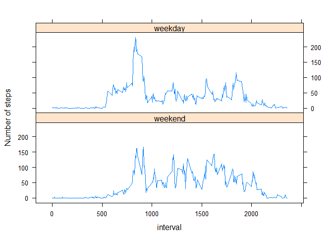

## Introduction

This is my response to the peer assessment exercise in course "Reproducible Research". The answers to the different questions provided in the exercise are compiled in a single R Markdown document.

The original GitHub repository was forked onto my own repository. It includes the dataset with measurements from a personal monitoring device. This dataset is in the base project directory, within a zip file called **activity.zip**.

The paragraphs below show the means to load the data, process and plot them according to the provided instructions.

## Loading and preprocessing the data

The chunk of code below aims at loading the data from the .csv file **activity.csv** placed inside the provided zip file. The data consists of two months of data from an anonymous individual collected during the months of October and November, 2012 and include the number of steps taken in 5 minute intervals each day.


```r
    unzip("./activity.zip",exdir=".")
    data<-read.csv("activity.csv")

    # Preprocess data:
    data$date<-as.Date(data$date,"%Y-%m-%d")    
```

Now the measurements are included in a data frame called "data". 

## What is mean total number of steps taken per day?

For this part of the assignment, missing values in the dataset are ignored. The code chunks below implement the following instructions:

1. Calculate the *total number of steps* taken per day
2. Make a *histogram* of the total number of steps taken each day
3. Calculate and report the *mean* and *median* of the total number of steps taken per day


```r
    library(dplyr)

    # Summarize the steps per day
    summary1 <- data %>% group_by(date) %>% summarize(total=sum(steps,na.rm=TRUE))

    # Plot the resulting histogram
    hist(summary1$total,main="Histogram of number of steps per day",
         xlab="Number of steps",breaks=10)
```

<!-- -->

```r
    # Compute the mean and median
    mymean<-mean(summary1$total,na.rm=TRUE)
    mymedian<-median(summary1$total,na.rm=TRUE)
```

The mean of the steps per day is 9354.2295082 and the median is 10395.

## What is the average daily activity pattern?

The next step is to make a **time series plot** of the 5-minute interval (x-axis) and the average number of steps taken, *averaged across all days* (y-axis):


```r
    # Summarize the steps per 5-min interval
    summary2 <- data %>% group_by(interval) %>% summarize(stepsperinterval=mean(steps,na.rm=TRUE))

    # Plot the result
    plot(summary2$interval,summary2$stepsperinterval,type="l",main="Step pattern",
         xlab="5-min interval in the day", ylab="Average of steps per interval")
```

<!-- -->

```r
    # Compute the mean and median
    mymax<-summary2$interval[summary2$stepsperinterval==
                             max(summary2$stepsperinterval,na.rm=TRUE)]
    myhours<-trunc(mymax/60)
    mymins<-trunc(mymax-myhours*60)
```

The 5-min interval with the maximum number of steps (in average), is number 835, that is, the one corresponding to 13 hours and 55 minutes.

## Imputing missing values

Note that there are a number of days/intervals where there are missing values (coded as **NA**). The presence of missing days may introduce bias into some calculations or summaries of the data. The following chunks of code provide the answer to the following instructions:

1. Calculate and report the *total number of missing values* in the dataset (i.e. the total number of rows with NAs)
2. Devise a *strategy* for filling in all of the missing values in the dataset.
3. Create a *new dataset* that is equal to the original dataset *but with the missing data filled in*.
4. Make a *histogram* of the total number of steps taken each day and
5. Calculate and report the *mean* and *median* total number of steps taken per day.


```r
    # Number of missing values in the dataset
    mymissing <- sum(is.na(data$steps))
    # Filling in all of missing values with mean steps per interval computed before.
    data2<-data
    data2$steps[is.na(data$steps)]<-
        trunc(summary2$stepsperinterval[match(data$interval[is.na(data$steps)],
                                              summary2$interval)])

    # Summarize the steps per day
    Newsummary1 <- data2 %>% group_by(date) %>% summarize(total=sum(steps,na.rm=TRUE))
    # Plot the resulting histogram
    hist(Newsummary1$total,main="Histogram of number of steps per day (NA values=estimated)",
         xlab="Number of steps",breaks=10)
```

<!-- -->

```r
        # Compute the mean and median
    mynewmean<-mean(Newsummary1$total,na.rm=TRUE)
    mynewmedian<-median(Newsummary1$total,na.rm=TRUE)
```

2304 missing values in dataset. The mean of the steps per day, estimating the NA values in the dataset as the truncated mean number of steps corresponding to the corresponding 5-min interval in the day is 1.074977\times 10^{4} and the median is 1.0641\times 10^{4}. They are significantly higher than the original values 9354.2295082 and 10395, as more than two thousand records with values in the range of tens to hundreds of steps are newly introduced. 

## Are there differences in activity patterns between weekdays and weekends?

For this part, the dataset with the filled-in missing values will be used.

The following chunk of code implements the following instructions:

1. Create a *new factor variable* in the dataset with two levels – “weekday” and “weekend” indicating whether a given date is a weekday or weekend day.
2. Make a *panel plot* containing a time series plot of the 5-minute interval (x-axis) and the average number of steps taken, averaged across all weekday days or weekend days (y-axis). 


```r
    # Make the new factor variable with two levels, "weekday" and "weekend"
    data2$isweekday<-factor(weekdays(data2$date) %in%
                        c("Monday","Tuesday","Wednesday","Thursday","Friday"),
                        labels=c("weekend","weekday"))

    # Summarize the steps per day
    Newsummary2 <- data2 %>% group_by(interval,isweekday) %>%
        summarize(stepsperinterval=mean(steps,na.rm=TRUE))

    # Plot the results
    library(lattice)
    xyplot(stepsperinterval ~ interval | isweekday, data=Newsummary2,
           layout=c(1,2),type="l",ylab="Number of steps")
```

<!-- -->

We can notice a different pattern between weekdays and weekends. The peak in weekdays seems to correspond to an habitual lunch break walk. Getting earlier on weekdays is also a trend.

I hope you enjoyed the report!
